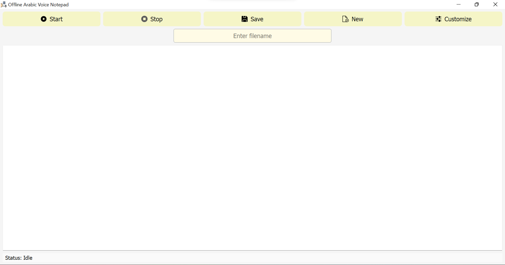

# Offline Arabic Voice Notepad

An offline desktop application for transcribing Arabic speech to text in real time using [Vosk](https://alphacephei.com/vosk/) and PyQt5.

This tool allows you to dictate in Arabic and see the text appear inside a styled notepad, with features like saving into a docx file, voice-controlled input, and text customization.

---

## Features

- Real-time **Arabic speech recognition**
- Rich text editor with:
  - Font, size, and style customization
  - Right-to-left writing support
- Save your notes as `.docx`
- Offline (no internet required)

---

## UI Preview



---

## Folder Structure

```
voice_notepad/
├── main.py
├── voiceNotepadUI.py
├── speechThread.py
├── customizePopup.py
├── assets/              # Icons and images
├── models/              # (YOU need to download this)
└── README.md
```

---

## Requirements

- Python 3.8 or higher
- PyQt5
- vosk
- python-docx
- pyaudio

Install dependencies:

```bash
pip install -r requirements.txt
```

---

## Download the Vosk Arabic Model

This project uses the Vosk Arabic model for offline speech recognition.

**Download the model here**:  
[vosk-model-ar-mgb2-0.4](https://alphacephei.com/vosk/models)

After downloading:

1. Unzip the folder
2. Place it inside the `models/` directory like so:

```
voice_notepad/
└── models/
    └── vosk-model-ar-mgb2-0.4/
```

---

## How to Run the App

From the project root directory:

```bash
python main.py
```

---

## Author

Developed by [Sara Abid](https://github.com/abid-sara)
